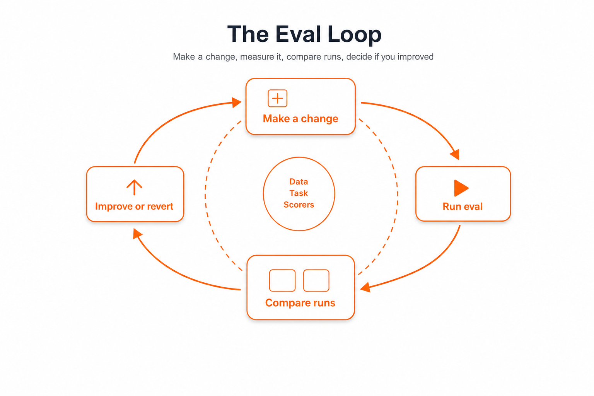
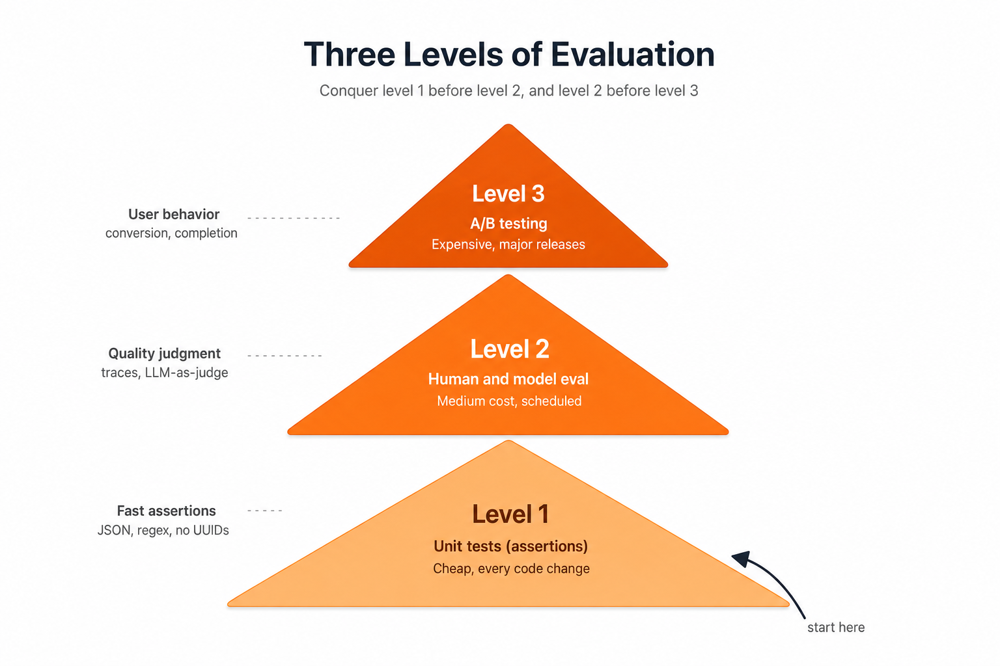
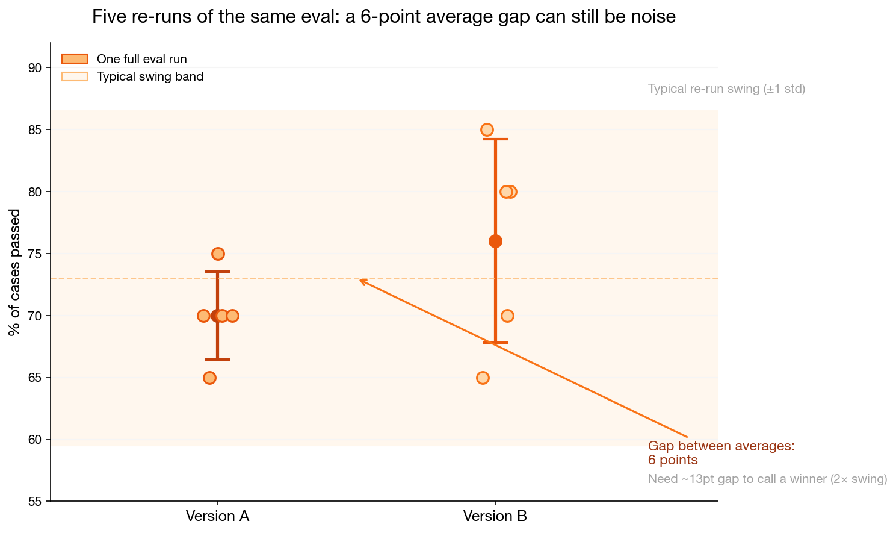

A few years ago, building an LLM-powered feature was mostly prompt engineering. You'd try a few system messages, run a couple of manual tests, and if it felt right, you shipped. That worked fine for prototypes and demos. But as soon as you needed to do anything real (handle varied user inputs, support multiple languages, integrate with external APIs, or just ensure yesterday's fix didn't break today's behavior), the "just vibe check it" approach collapsed.

What separates demo-quality AI products from production-grade ones is **evaluation**. Not better prompts, not bigger models, not fancier architectures. A systematic way of measuring whether your system is getting better or worse, and catching regressions before your users do.

This post is for anyone who's built an LLM feature and thought, "I have no idea if this is actually good." We'll cover what evals are, why they matter, and walk through concrete examples using Python and [Braintrust](https://www.braintrust.dev), a tool that makes eval infrastructure easier.

---

## What is an eval, really?

An LLM evaluation, or "eval", is a test that measures how well your model output meets a criterion. It's the same muscle as writing unit tests for regular code: you define an input, decide what "good" looks like, and check.

The three ingredients are always the same:

1. **Data**: test cases with inputs and (optionally) expected outputs
2. **Task**: the function or prompt that calls the LLM
3. **Scorers**: metrics that judge the output's quality

Here's the simplest possible eval in Braintrust. We have a greeting bot, and a first version that's buggy: it greets one user correctly but uses the wrong greeting for the other.

```python
from braintrust import Eval
from autoevals import ExactMatch

Eval(
    "Say Hi Bot",
    data=lambda: [
        {"input": "Foo", "expected": "Hi Foo"},
        {"input": "Bar", "expected": "Hi Bar"},
    ],
    # Buggy: only Foo gets the right greeting
    task=lambda input: "Hi " + input if input == "Foo" else "Hey " + input,
    scores=[ExactMatch],
)
```

Run it from the terminal with `braintrust eval say_hi.py`, and you get:

```
50.00% 'ExactMatch' score
("Hi Foo" matches, "Hey Bar" does not match "Hi Bar")
```

Now fix the task to `task=lambda input: "Hi " + input` and re-run. Braintrust automatically compares the two runs:

```
100.00% (+50.00%) 'ExactMatch' score (1 improvement, 0 regressions)
```

That's the core loop: make a change, run the eval, see if you improved. (We used `ExactMatch` here for a clean pass/fail; `LevenshteinScorer` would instead return a fuzzy similarity between 0 and 1.) Simple to understand, powerful in practice.



---

## The case for evals (what goes wrong without them)

Teams that ship LLM features without evals often hit the same wall: they can change the system, but they cannot tell whether a change helped. Unsuccessful products frequently share that root cause: no robust way to measure quality before and after each change.

The symptoms of skipped evals are predictable:

- **Whack-a-mole.** Fixing one failure mode introduces another. Your prompt grows into an unmaintainable 200-line monster trying to cover every edge case.
- **No visibility.** You have no idea if the system is actually performing across different scenarios. Everything is a vibe check.
- **Plateau.** You stop making progress because you can't tell what's helping and what's hurting.

The key insight: most people focus on *changing* the system (prompt engineering, switching models, rewriting RAG pipelines) while skipping *measuring* the system. Without measurement, every change is a guess.

---

## The three levels of evaluation

A practical way to organize evals in production is three levels:

| Level | Kind | Cost | Cadence |
|-------|------|------|---------|
| 1 | Unit tests (assertions) | Cheap | Every code change |
| 2 | Human & model eval | Medium | Scheduled |
| 3 | A/B testing | Expensive | Major releases |

You want to conquer level 1 before moving to 2, and 2 before 3. But all three are part of a continuous system.



---

### Level 1: Unit tests (assertions)

These are the cheapest and most important. Like pytest assertions for your LLM outputs. They should be fast enough to run on every commit.

**Generic tests** check things like: "no UUIDs leaked in output", "response is valid JSON", "output is under 2000 characters".

Here's a concrete example: a test that ensures internal UUIDs aren't exposed to users:

```javascript
const noExposedUUID = message => {
  const sanitizedComment = message.comment.replace(/\{\{.*?\}\}/g, '')
  const regexp = /[0-9a-f]{8}-[0-9a-f]{4}-[0-9a-f]{4}-[0-9a-f]{4}-[0-9a-f]{12}/ig
  const matches = Array.from(sanitizedComment.matchAll(regexp))
  expect(matches.length, 'Exposed UUIDs').to.equal(0, 'Exposed UUIDs found')
}
```

**Scenario tests** break your system into features and edge cases. For a listing search feature:

| Scenario | Assertion |
|----------|-----------|
| Exactly one match | `len(results) == 1` |
| Multiple matches | `len(results) > 1` |
| No matches | `len(results) == 0` |

A key difference from traditional unit tests: **you don't need 100% pass rate**. The pass rate you accept is a product decision based on how much failure your users will tolerate.

#### Generating test cases

You don't need to wait for production data. Use an LLM to generate synthetic test cases that cover your edge cases. Here's the kind of prompt you'd use for a CRM assistant:

```
Write 50 different instructions that a real estate agent can give to 
his assistant to create contacts on his CRM. The contact details can 
include name, phone, email, partner name, birthday, tags, company, 
address and job.

For each instruction, generate a second instruction to look up the 
created contact. Output should be a JSON array like:
[
  ["Create a contact for John (johndoe@apple.com)", 
   "What's the email address of John Smith?"]
]
```

This gives you pairs like:

```python
[
    ["Add Emily Johnson with phone 987-654-3210, email emilyj@email.com, and company ABC Inc.",
     "What's the phone number for Emily Johnson?"],
    # ... 48 more
]
```

Run each pair through your system: create the contact, verify you can retrieve it. If the retrieval returns exactly one result, the test passes.

---

### Level 2: Human and model evaluation

Unit tests catch clear-cut failures. But many LLM outputs are *qualitatively* wrong: technically correct but unhelpful, or plausible-sounding but factually incorrect. This needs a human or an LLM judge.

#### Logging traces

Before you can evaluate, you need to log what's happening. A trace is a record of a conversation or a request flow: every user message, every LLM call, every tool invocation, every intermediate result. Tools like LangSmith, Braintrust, or open-source alternatives like OpenLLMetry handle this. The key features you need are **searching, filtering, and reading traces easily**.

#### Look at your data. Actually look at it.

There is no substitute for reading traces yourself. Sampling can scale later, but early on you need to look at enough real and synthetic examples to build intuition for what "good" means in your domain.

The most successful eval workflows build custom dashboards that render traces in domain-specific ways. One team built a review tool in a day (using Shiny for Python) that showed all relevant context on one screen: which feature was being evaluated, whether the input was synthetic or real, links to the CRM and the trace system.

When starting, aim to examine every trace from every test case and as many real user traces as you can. Over time you can sample, but you can never stop entirely.

#### LLM-as-judge

You can use a more powerful LLM to critique your production model's outputs. The general approach:

1. Your production model generates a response.
2. A judge model (typically a frontier model like GPT-4o or Claude) evaluates that response for correctness, using a rubric you provide.
3. The judge returns a binary outcome (good/bad) and optionally a critique.

The judge model doesn't need to be fast; it's not serving users. But it needs to be *aligned with your human evaluators*. Run the judge and a human on 25-50 examples, iterate the judge prompt until they agree, then re-check periodically. Track precision and recall separately (raw agreement is misleading on imbalanced classes).

#### Custom GEval-style judges (`LLMClassifier`)

Built-in scorers like `Factuality` are pre-packaged LLM judges. When you need your own criteria (tone, policy compliance, format rules), use `LLMClassifier` from `autoevals`. This is the same idea as a **GEval** in other frameworks: write the rubric in plain English, let a frontier model score each output.

Every custom judge has three parts:

| Part | What it does |
|------|----------------|
| `prompt_template` | Tells the judge what to check. Use `{{input}}`, `{{output}}`, and optionally `{{expected}}`. |
| `choice_scores` | Maps the judge's label to a number between 0 and 1. |
| `use_cot=True` | Judge explains its reasoning (stored in metadata; helps you debug). |

**Example 1: pass/fail against a reference answer**

```python
from autoevals import LLMClassifier

refund_correct = LLMClassifier(
    name="RefundCorrect",
    prompt_template="""Did the assistant answer correctly?

User: {{input}}
Assistant: {{output}}
Reference: {{expected}}

Reply with exactly one label: Pass or Fail.""",
    choice_scores={"Pass": 1, "Fail": 0},
    use_cot=True,
)
```

**Example 2: three-tier quality (no reference answer needed)**

```python
professional_tone = LLMClassifier(
    name="ProfessionalTone",
    prompt_template="""Rate the assistant's tone for a bank chat.

User: {{input}}
Assistant: {{output}}

Pick one: Good, Ok, or Bad.""",
    choice_scores={"Good": 1, "Ok": 0.5, "Bad": 0},
    use_cot=True,
)
```

**Example 3: wire it into an eval**

```python
from braintrust import Eval

Eval(
    "Refund Assistant",
    data=lambda: [
        {
            "input": "Can I return this after 30 days?",
            "expected": "Yes, within the 60-day return window.",
        },
    ],
    task=answer_refund_question,
    scores=[refund_correct],  # your custom judge, same slot as Factuality
)
```

Start with a short criteria sentence. If scores feel random, make the prompt more specific (list what counts as pass/fail) before adding more trials.

For checks that do not need an LLM (valid JSON, no leaked UUIDs, output in an allowed set), use a plain Python function scorer instead. Reserve `LLMClassifier` for subjective quality.

---

#### Running the judge multiple times: dealing with randomness

One of the most commonly overlooked details in LLM-as-judge evals is that **judges are stochastic too**. Even with `temperature=0`, LLMs aren't truly deterministic: GPU non-determinism, floating-point accumulation, and sampling implementation details mean you'll get minor variations across runs. With `temperature > 0` (which many practitioners use to give the judge "creativity" to catch subtle issues), variance goes up significantly.

If you run your entire eval once, score 73%, change a prompt, re-run, and score 78%, is that a real improvement or just noise?

There's a growing body of research on this. A 2025 paper titled *"The Coin Flip Judge? Reliability and Bias in LLM-as-a-Judge Evaluation"* found that LLM judges can exhibit near-random agreement patterns under certain conditions. *"Judge Reliability Harness: Stress Testing the Reliability of LLM Judges"* systematically shows how judge reliability degrades with task complexity. And *"Diagnosing the Reliability of LLM-as-a-Judge via Item Response Theory"* demonstrates that a judge's reliability varies per test case (it's not uniform across your dataset), meaning some outputs are easy to judge and others are inherently ambiguous. This is an active research area, not settled science.

So what do you do in practice while the research catches up?

**Run multiple trials per test case and aggregate.** Instead of taking one judge verdict per test case, run the judge N times and average the results. This is standard frequentist reasoning: averaging reduces noise from independent stochastic calls.

A practical approach looks like:

| Trials per case | What you get | When to use |
|-----------------|-------------|-------------|
| 1 | A single noisy number | Quick sanity checks, deterministic scorers (exact match, regex) |
| 3-5 | Mean with rough confidence (heuristic) | Day-to-day iteration on prompts or RAG |
| 10+ | Smoother estimate | Before shipping a change, comparing models |

These trial counts are **practical heuristics**, not research-backed prescriptions. Exactly how many trials you need depends on your judge's variance, which you won't know until you measure it. What the research does tell us is: judge reliability varies per task, per model, and even per individual test case, so the right number of trials will depend on your specific setup.

A typical workflow on iteration looks like:

```python
from braintrust import Eval, EvalCase
from autoevals import Factuality

Eval(
    "Refund Assistant",
    data=lambda: [
        {
            "input": "Can I return this after 30 days?",
            "expected": "Yes, within the 60-day return window.",
        },
        EvalCase(
            input="What's your policy on damaged items?",
            expected="Full refund or replacement for damaged goods.",
            trial_count=10,  # bump trials on ambiguous cases
        ),
    ],
    task=answer_refund_question,
    scores=[Factuality],  # LLM-as-judge; stochastic, so trials matter
    trial_count=5,        # default: run each case 5 times
)
```

Braintrust buckets rows by `input`, aggregates scores across trials, and shows confidence intervals in the dashboard instead of a single misleading number. When you compare two experiments, it surfaces the probability that an improvement is real (not a fluke of randomness).

**A concrete example: comparing two versions step by step**



Learn four terms first. Everything else uses them.

| Term | Meaning |
|------|---------|
| **Score** | % of test cases the judge passes in one eval run (14/20 → 70%) |
| **Run** | One full pass over all test cases |
| **Average** | Mean score across several runs |
| **Gap** | Version B's average minus Version A's average |

**Step 1: One run is a snapshot, not a verdict.**

Two prompts, same 20 cases, LLM judge marks each pass/fail.

| | Version A | Version B |
|---|-----------|-----------|
| Run 1 | 70% (14/20) | 80% (16/20) |
| Looks like... | | B wins by **10 points** |

Easy to ship B. Don't yet.

**Step 2: Re-run the identical eval.**

Same cases, same models, same judge. The judge flips on borderline answers:

| Run | A | B | B minus A |
|-----|---|---|-----------|
| 1 | 70% | 80% | +10 |
| 2 | 75% | 65% | **−10** |
| 3 | 65% | 85% | +20 |
| 4 | 70% | 70% | 0 |
| 5 | 70% | 80% | +10 |

Run 2 flips the winner. One score hid that.

**Step 3: Compute averages, then the gap.**

| | Average across 5 runs |
|---|----------------------|
| Version A | **70%** |
| Version B | **76%** |
| **Gap** | **76 − 70 = 6 points** |

The gap is **not** the 10-point lead from run 1. It is the distance between the two averages.

**Step 4: Measure the swing (noise).**

How far do scores move when nothing changed? Across these five runs, scores typically move about **±7 points**. That wiggle is measurement noise, not a real improvement.

**Step 5: Compare gap to swing.**

| Question | This example |
|----------|--------------|
| Gap between versions | 6 points |
| Typical swing per run | ±7 points |
| Gap needed to call a winner (2× swing) | ~14 points |
| Verdict | **Tie.** 6 is inside the noise. |

**Reading the chart:** each dot = one run from the table. Markers = averages. Shaded band = ±7 point swing. The 6-point gap sits inside the band, so the versions are indistinguishable so far.

**What to do:** report average ± spread, not a single run. Use `trial_count` in Braintrust, or re-run manually. To shrink noise: align the judge with human labels, or run more trials (uncertainty on the mean drops by 1/√N).

Some test cases bounce more than others; flag high-variance cases for human review.

---

### Level 3: A/B testing

At the mature end, you measure whether your AI is actually driving user behavior: conversion rates, task completion, time saved. This is standard product A/B testing, and you shouldn't worry about it until your system is solid on levels 1 and 2.

---

## Braintrust code: a complete example

Let's put it all together. Here's an eval that tests a medical triage system, one of the best examples because it combines multiple scorers (including a custom one and LLM-as-judge):

```python
from braintrust import Eval
from autoevals import Factuality, LevenshteinScorer
from openai import OpenAI
import os

client = OpenAI(api_key=os.getenv("OPENAI_API_KEY"))

TRIAGE_PROMPT = """You are a medical triage assistant. Given patient symptoms,
classify urgency as exactly one of: EMERGENCY, URGENT, STANDARD, LOW-PRIORITY.
Return ONLY the classification label, nothing else."""

def triage_patient(input: str) -> str:
    response = client.chat.completions.create(
        model="gpt-4o-mini",
        messages=[
            {"role": "system", "content": TRIAGE_PROMPT},
            {"role": "user", "content": f"Patient symptoms: {input}"},
        ],
        max_tokens=20,
        temperature=0.1,
    )
    return response.choices[0].message.content.strip()

# Custom scorer: checks if output is a valid triage category
def valid_category(input, output, expected):
    valid = {"EMERGENCY", "URGENT", "STANDARD", "LOW-PRIORITY"}
    return {
        "name": "ValidCategory",
        "score": 1.0 if output in valid else 0.0,
    }

Eval(
    "Healthcare Triage",
    data=lambda: [
        {
            "input": "Severe chest pain, shortness of breath, sweating, radiating to left arm",
            "expected": "EMERGENCY",
        },
        {
            "input": "Persistent cough for 3 weeks, mild fever, fatigue",
            "expected": "URGENT",
        },
        {
            "input": "Annual checkup, no complaints, requesting routine blood work",
            "expected": "LOW-PRIORITY",
        },
        {
            "input": "Sprained ankle while playing basketball, can bear weight",
            "expected": "STANDARD",
        },
        {
            "input": "Sudden severe headache, confusion, difficulty speaking",
            "expected": "EMERGENCY",
        },
    ],
    task=triage_patient,
    scores=[
        LevenshteinScorer,   # String similarity to expected
        Factuality,          # LLM-as-judge: output consistent with expected?
        valid_category,      # Custom: is output in allowed set?
    ],
)
```

Every test case is scored on three dimensions simultaneously:

- **LevenshteinScorer:** string similarity (catches typos and format drift)
- **Factuality (LLM-as-judge):** semantic correctness (a judge model decides whether the output is factually consistent with the expected label, instead of demanding a character-for-character match)
- **ValidCategory (custom):** format compliance (is the output one of the four allowed strings?)

Braintrust logs everything to its dashboard: input, output, expected, each score, token counts, duration, and cost. Swap the model (say from `gpt-4o-mini` to `gpt-4o`) or update the prompt, re-run, and the dashboard shows a side-by-side diff of which test cases improved or regressed.

---

## Evaluations unlock superpowers

Once you have a robust eval system, other things get much easier:

### Fine-tuning

Fine-tuning is the best way to teach an LLM domain-specific syntax, style, and rules. But it's 99% data assembly. If you already have:

- Synthetic test cases from your Level 1 test generation
- Traces from production use
- Curated examples from human evaluation

...then you already have your fine-tuning dataset. Use your scorers as filters: only keep data that passes your assertions, or use your judge model to label high-quality examples.

### Debugging

When a user reports a bad response, your eval infrastructure serves as your debugger:

- Search through logged traces to find similar inputs
- Re-run those inputs through your current system
- Compare against the version that produced the bad output
- Write a new test case from the failure
- Fix the prompt or model, confirm the test passes, and move on

The overlap between eval infrastructure and debugging infrastructure is nearly total.

### Agent iteration with Braintrust MCP

The eval loop is easy to describe and painful to run by hand: change a prompt, open the dashboard, copy failures into chat, guess a fix, repeat. [Braintrust MCP](https://www.braintrust.dev/docs/integrations/developer-tools/mcp) lets your coding agent run that loop in the IDE. You still execute evals from the terminal (or [`bt` CLI](https://www.braintrust.dev/docs/reference/cli/quickstart)); MCP is how the agent reads results and proposes the next edit.

On the healthcare triage example above, you might ask:

> Summarize my latest Healthcare Triage experiment vs the previous run. Which scorer regressed?

The agent might see `ValidCategory` drop while `Factuality` holds: semantics are fine, output format broke. Follow up with:

> Show me rows where ValidCategory failed but Factuality passed.

It pulls those cases from Braintrust, spots `"Urgent"` instead of `URGENT`, patches the system prompt, and you re-run. Same loop works for `LLMClassifier` judge rubrics: find disagreements, tighten the template, measure again.

With trials enabled, the agent can also sanity-check whether a score bump is real or just noise (see the noise-floor section above).

---

## Common pitfalls

**Waiting for production data.** You don't need thousands of real user queries to start. Generate synthetic data with an LLM, make educated guesses about edge cases, and refine as real usage comes in.

**Buying fancy tools before understanding the problem.** Start with pytest assertions and a spreadsheet. Add sophistication incrementally.

**Not looking at enough data.** If you can't remember the last time you read a raw model output, you're not looking at enough.

**Relying on generic eval frameworks.** Generic benchmarks (MMLU, GSM8K, HumanEval) measure general capability. They won't tell you if your chatbot handles refund requests correctly. Build domain-specific evals.

**Chasing 100% passes.** Decide what failure rate is acceptable for your use case. A 95% pass rate on "no UUIDs leaked" might be fine for a toy app but catastrophic for a medical system.

---

## The one-sentence takeaway

A production-grade LLM system is not one with better prompts or a bigger model. It's one with a systematic eval loop that lets you measure every change, catch every regression, and continuously improve based on data instead of vibes.

Build the eval first. Everything else follows.

---

## Further reading

- [Your AI Product Needs Evals](https://hamel.dev/blog/posts/evals/): why eval infrastructure matters for LLM products
- [Braintrust Docs: Evaluations](https://www.braintrust.dev/docs/guides/evaluations): Braintrust's eval framework
- [Braintrust MCP](https://www.braintrust.dev/docs/integrations/developer-tools/mcp): query experiments and iterate on prompts from your coding agent
- [Braintrust Evaluation Examples](https://github.com/zubairashfaque/braintrust-evaluation-examples): a collection of practical eval patterns
- [Levels of Complexity in RAG Applications](https://jxnl.github.io/blog/writing/2024/02/28/levels-of-complexity-rag-applications/): evaluating retrieval-augmented generation
- [Evaluating LLMs: A Guide to Best Practices](https://arize.com/blog/evaluating-llms/): general eval strategies from Arize AI
