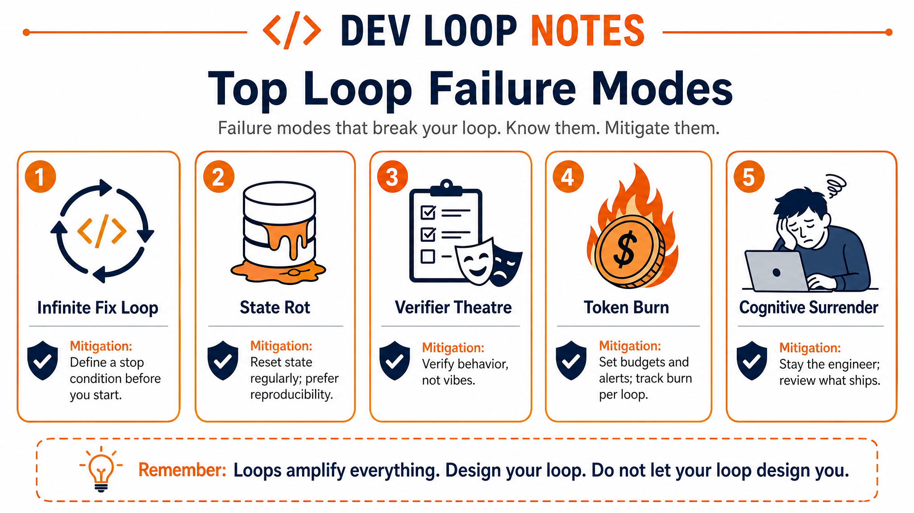

**Loop Engineering series · 6 of 6** · [Previous](/blog/loop-engineering-patterns)

Loops are early. The economics and verification challenges are real. Every conversation about Loop Engineering tends to focus on the power, and it is powerful. But the people doing this work are also the ones who've learned the hard lessons. This post collects them, with mitigations specific to **Souso**, where we just built our first loop.

*Haven't run the example yet? [Post 4](/blog/loop-engineering-your-first-loop) has the clone-and-run walkthrough.*

---

# Token Economics: The Hidden Cost

**PR Babysitter** (from the [patterns post](/blog/loop-engineering-patterns)): polls open PRs every few minutes. Cheap when nothing is wrong; expensive on a busy branch because every run may spawn sub-agents.

**CI Sweeper**: only runs meaningful work when CI is red, but each incident can chain implementer + verifier + full test suite. That adds up fast at a 15-minute cadence.

Token costs vary wildly depending on design:

| Loop | Cadence | Runs/day | Rough daily tokens |
|------|---------|----------|-------------------|
| Daily Triage on Souso (L1) | 1d | 1 | ~50k |
| PR Babysitter (active `develop`) | 5m | 288 | Very high |
| CI Sweeper (full implementer + verifier) | 15m | 96 | ~5M |

A 5-minute loop that spawns implementer + verifier on every run will burn through a limited plan before breakfast. **Triage should be cheap; sub-agents spawn only when state says actionable.** An empty watchlist should exit in under 5,000 tokens.

**Souso cost controls** (encoded in `loop-budget.md`):
- 500k tokens/day cap → pause schedule on exceed
- L1 only until one week of accurate triage
- Log estimated tokens per run in `loop-run-log.md`
- Active hours 08:00–20:00 Europe/Amsterdam

---

# How to read severity labels (S1, S2, S3)

These are **not** the same as readiness levels (**L1**, **L2**, **L3** from the patterns post). **L** = how much autonomy you gave the loop. **S** = how bad things get if a failure mode is left alone.

| Label | Meaning | Example |
|-------|---------|---------|
| **S1** | Early warning. Wasteful or annoying, but the loop is still basically under control. | Token bill creeping up; noisy Slack |
| **S2** | Active problem. The loop is misleading you, stuck, or burning resources. Fix this week. | Infinite fix retries; stale `STATE.md` |
| **S3** | Serious harm. Wrong code merged, denylisted paths touched, or production behaviour at risk. Stop the loop and roll back. | Auto-refactor on owned pricing code |

An arrow like **S1 → S2** means: starts mild if you catch it early; becomes S2 if you ignore it.

---

# Failure Mode Catalog

This catalog adapts the failure modes and anti-patterns in [Cobus Greyling's loop-engineering repo](https://github.com/cobusgreyling/loop-engineering) ([operating docs](https://github.com/cobusgreyling/loop-engineering/tree/main/docs), MIT). Mitigations below are Souso-specific.

## Infinite Fix Loop (S2)

**Symptom**: Same PR or CI job gets 5+ fix attempts; never converges.  
**Souso mitigation**: Hard cap of 3 attempts in `loop-budget.md`. Separate verifier model. For matcher eval failures, escalate. Don't let the loop rewrite `src/lib/pricing/*`.

## State Rot (S1 → S2)

**Symptom**: `STATE.md` references merged PRs or closed issues. Loop acts on ghosts.  
**Souso mitigation**: `loop-triage` skill requires pruning closed items every run. Validate issue numbers against `gh issue view` before acting.

## Verifier Theatre (S2)

**Symptom**: Verifier "approves" but `pnpm quality` fails in CI.  
**Souso mitigation**: Verifier must run `pnpm test` at minimum; for L3, full `pnpm quality`. Souso's pre-push hook already runs format + lint + typecheck + build + tests + matcher eval. The verifier should mirror that, not eyeball diffs.

## Notification Fatigue (S1 → S2)

**Symptom**: Slack pings every 5 minutes; team mutes the bot.  
**Souso mitigation**: L1 is silent (STATE.md only). Slack posts only on escalation to `#loop-escalations`, not every triage run.

## Token Burn (S1)

**Symptom**: Bill spikes.  
**Souso mitigation**: Daily Triage at 1d cadence. PR Babysitter deferred until L1 proven. `loop-run-log.md` catches creep early.

## Over-Reach: Wrong Scope (S2 → S3)

**Symptom**: Loop refactors unrelated modules or touches denylisted paths.  
**Souso mitigation**: `loop-budget.md` denylist: `src/lib/pricing/*`, week generation, migrations, auth, Mollie tipping. `ship-flow-and-ownership` skill: raise owned-flow bugs with a failing test, don't silently rewrite internals.

## Comprehension Debt Spiral (S2)

**Symptom**: Velocity up; no one can explain recent changes.  
**Souso mitigation**: Eval gates (`pnpm eval`, replan-agent eval, memory-classifier eval) exist to lock AI behaviour. A loop that ships code nobody understands bypasses those gates. Mandatory human review on non-trivial PRs. Weekly read of `loop-run-log.md`.

## Cognitive Surrender (S2, Cultural)

**Symptom**: "The loop handles it." No opinions on correctness.  
**Souso mitigation**: Success metric = time saved *with* quality bar held. `pnpm quality` + branch protection on `develop` and `main` are human gates the loop cannot override.

## Parallel Collision (S2)

**Symptom**: Two sub-agents edit same files; merge conflicts.  
**Souso mitigation**: `isolation: worktree` for all L2+ code edits. Queue `ready-for-agent` issues in `STATE.md`: one active worktree per issue.

## Escalation Failure (S2)

**Symptom**: Loop stuck retrying; human never notified.  
**Souso mitigation**: "Waiting on Human" section in `STATE.md`. Alert if item sits >24h. Slack connector on third failed attempt.

---

# Anti-Patterns (Design Time)

1. **Same agent implements and verifies**: confirmation bias wins
2. **No attempt cap**: infinite fix loops on flaky CI
3. **Vague triage output**: paragraphs the loop can't parse; Souso requires one-liners
4. **L3 before L1 quality**: auto-fix on day one; measure triage accuracy first
5. **Shared state without schema**: three loops appending to unstructured `STATE.md`
6. **MCP with write-everything scope**: one bad triage decision, maximum blast radius
7. **No kill switch**: document pause in `LOOP.md` and `loop-budget.md`
8. **Fixing flakes with code**: masks infra problems; classify → quarantine → escalate
9. **Auto-merge without allowlist**: security bugs pass weak verifiers
10. **No run log**: can't debug "why did it touch pricing Tuesday?"

---

# Safety & Guardrails on Souso

## Path Denylist

Never auto-edit without human approval:

- `src/lib/pricing/*` (matcher, ownership-sensitive)
- Week generation / replan internals
- `.env`, secrets, credentials
- `drizzle/migrations/*`
- `auth/`, Mollie tipping

## Auto-Merge Policy

**Default: no auto-merge.** If you must at L3, allow only: typos in comments/docs, lint auto-fix in test files. Never: behaviour changes, dependency bumps, denylist paths.

## MCP Least Privilege

| Connector | Read | Write |
|-----------|------|-------|
| GitHub | issues, PRs, checks | comment, label (not merge) |
| Linear | team issues | comment, status (not delete) |
| Slack | channel history | `#loop-escalations` only |
| D1 / prod DB | n/a | never from loops |

## Human Gates (Always Required on Souso)

- Security, auth, payments, PII
- Changes to owned AI flows
- Dependency upgrades (Workers compat risk)
- Changes touching >10 files
- Third failed attempt on same item
- Promotion `develop` → `main` (existing process unchanged)

---

# The Most Important Lesson

> *"The same loop design can accelerate someone who stays the engineer, or let someone abdicate judgment entirely."*
>
> Addy Osmani

We built a Daily Triage loop on Souso because the issue queue is real and the stakes are real: a deployed app with paying users, strict TDD, and a repo that already moved fast (350+ PRs merged in a Megathon weekend). The loop surfaces work. It does not replace judgment, code review, or `pnpm quality`.

Build the loop like someone who intends to stay the engineer. Not just the person who presses go.

---

**Loop Engineering series · 6 of 6** · [Start from the beginning](/blog/loop-engineering-the-end-of-prompting)

*Sources: [Addy Osmani's Loop Engineering](https://addyosmani.com/blog/loop-engineering/). Failure modes, anti-patterns, and safety framing from [Cobus Greyling's loop-engineering repo](https://github.com/cobusgreyling/loop-engineering) (MIT). [Cobus Greyling's Loop Engineering essay](https://cobusgreyling.substack.com/p/loop-engineering).*
