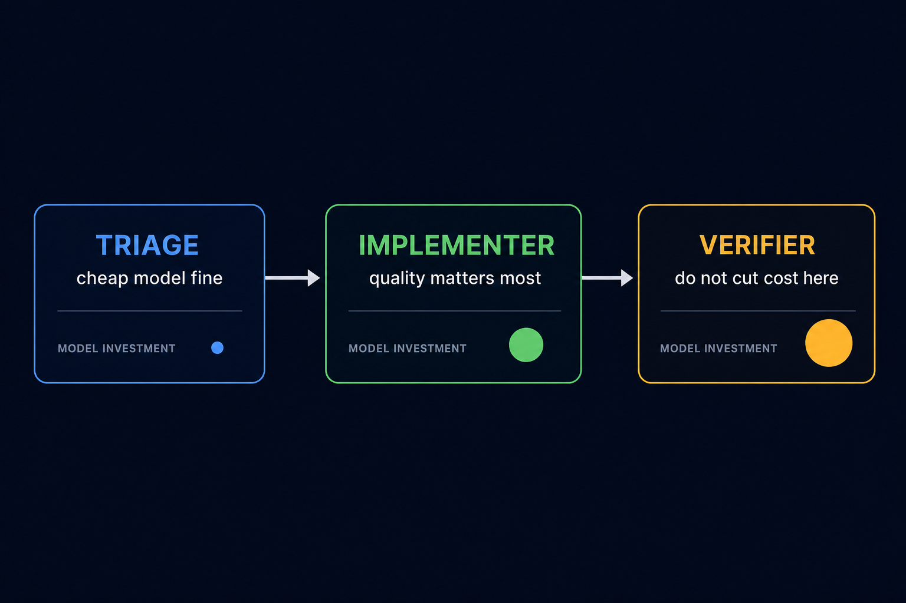
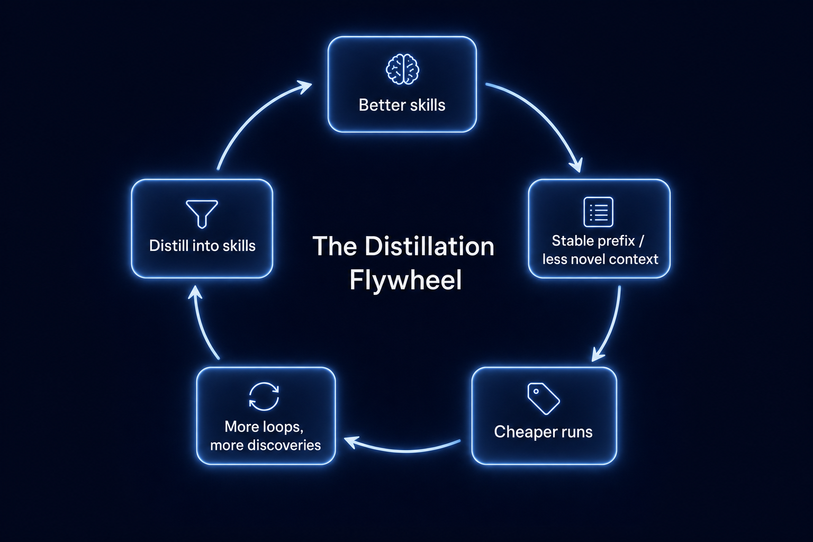

**Loop Engineering series · 7** · [Previous](/blog/loop-engineering-hard-realities)

---

If you've built a loop (a Daily Triage, a PR Babysitter, a CI Sweeper), you've probably run it on a single model. Probably Sonnet or Opus. You set the model once, pointed it at the loop, and didn't think much more about it.

That's fine to start. But it's not sustainable once loops run continuously, and it's not how the best-performing pipelines are designed.

**A loop isn't one task. It's three very different tasks running sequentially.** Each one has a different quality requirement, which means each one has a different price-optimal model. The question is: which model goes where?

The honest answer, as of mid-2026, is that nobody has published systematic data on this. There are strong hints, an emerging academic framing, and one or two products that have started shipping tiering features. But there is no benchmark, no tiering matrix with measured results, and no loop-engineering guide that addresses it directly.

This post collects what the research does say, and proposes what's needed to answer the question properly.

---

# The three roles

Every loop, regardless of the pattern, is doing three different kinds of work.

**Triage:** structured extraction. Read a batch of issues, CI runs, PRs, or dependency alerts. Classify by priority. Identify what's actionable. Write to `STATE.md`. This is pattern matching and structured output generation. It does not require deep reasoning. It does require accuracy: a bad triage classification wastes all downstream work.

**Implementation:** code generation. A sub-agent opens a worktree, writes or modifies code, runs tests. This is the role that actually does something. Quality variance is highest here. The difference between a cheap and a frontier model is most visible in the code that comes out.

**Verification:** adversarial review. A separate agent reviews the implementation's output. It must be a different agent from the one that wrote the code (same agent reviewing its own work is confirmation bias). It must run the actual test suite, not eyeball a diff. This is the last gate before a human sees the work.

The cost of failure is different for each:

| Role | Failure cost | Quality threshold |
|------|-------------|-------------------|
| Triage | Low. Miss rates are caught next run. | Moderate. Must classify correctly. |
| Implementer | Medium. Bad code needs a rework cycle. | High. Test pass rate matters. |
| Verifier | High. Approving bad code reaches humans. | Very high. False negatives are dangerous. |

---

# What the research says

## 1. Triage tolerates cheaper models

The most directly applicable academic work is a June 2026 paper out of Wroclaw University of Technology ([arXiv:2604.07494](https://arxiv.org/html/2604.07494)) that proposes routing software engineering tasks to different model tiers based on pre-computed code health scores.

The finding that matters here: **for clean, well-maintained codebases, cheaper models perform within acceptable range of frontier models on structured classification tasks.** A 15-30% relative improvement in correctness from using the strongest model only showed up on complex multi-file work, not on triage-style tasks like label classification or priority sorting.

The implication for loops: if your triage role is mostly "classify this issue and write a structured summary," you likely don't need a frontier model for it. Triage is structured extraction. It's expensive to overthink.

## 2. Verifiers are worth the cost

The same research shows the inverse for verification: **stronger models catch meaningfully more defects**. The gap is larger on messy codebases (where the implementer has taken shortcuts or inherited bad context), which is also when you most need the verifier to catch problems.

Augment Code's model routing guide (Apr 2026, updated Jun 2026) is the only source I've found that maps specific models to specific agent roles in a production coding system. Their recommendation for the verification role: use a different model family entirely, not just a stronger tier. They assign GPT-5.2 for code review specifically because "different strengths than Claude" means different failure modes, reducing the chance that both the implementer and verifier share the same blind spot.

For loop verifiers, the practical version of this: **don't let the cheapest viable model run verification.** The cost of a missed bug (a rework cycle, a bad merge, a human having to untangle it) almost always exceeds the token savings.

## 3. Planning errors are the most expensive

Claude Code shipped a feature called `opusplan`, a model alias that uses Opus during the plan mode and automatically switches to Sonnet for execution. It's a simple version of exactly this idea: spend more on the part that sets the direction, less on the part that executes it.

The reasoning is correct. **Planning errors cascade.** A bad subtask spec from a planner means the implementer works on the wrong thing, the verifier reviews the wrong output, and the triage next cycle inherits bad state. The entire downstream cost is a consequence of the single planning step. Frontier model on planning is probably the highest-ROI investment in the whole loop.

## 4. Mid-loop model switches are expensive in a non-obvious way

This one is less intuitive but matters a lot for design.

The vLLM team published [Session-Aware Agentic Routing (SAAR)](https://vllm.ai/blog/2026-06-02-session-aware-agentic-routing) in June 2026, the first academic treatment of model switching *within* multi-turn agent sessions. Key finding: **switching models mid-session invalidates the prompt cache for the new model.** That session started cold, even if the previous model had accumulated 80K tokens of warm context.

The paper's formulation:

> *"A short retry on a cheap model and a 40-turn warm session on a frontier model should not be treated the same way. The latter has accumulated a valuable prefix. Switching away from it may require the next physical model to pay a much larger input cost even if the visible user message is short."*

For loop design, this means: **pick a model per role and keep it consistent across iterations.** The safe switch boundary is between full loop iterations (after state is committed), not mid-iteration. Switching triage to Haiku 4.5 but escalating inside the same session to Opus doesn't save money. It pays full input cost for the Opus session from scratch.

---

# The caching lever nobody is talking about

There's a structural advantage loops have that single-shot prompts don't: **most of the prefix is identical across runs.**

Every iteration of a Daily Triage sends roughly the same first 80K tokens: system prompt, skills, `STATE.md`, project conventions, `AGENTS.md`. The only part that changes is the trailing suffix: today's issues, today's CI results, today's PR diffs. If that suffix is 5K tokens, caching saves 94% of input tokens on every run after the first.

The actual numbers, at current Anthropic pricing (80% cache hit, 50K input tokens, one run per day):

| Model | No caching/month | With caching/month | Savings |
|-------|------------------|--------------------|---------|
| Opus 4.8 | $7.50 | $2.10 | 72% |
| Sonnet 4.6 | $4.50 | $1.26 | 72% |
| Haiku 4.5 | $1.50 | $0.42 | 72% |
| DeepSeek V4-Pro | $0.65 | ~$0.08 | ~87% |
| DeepSeek V4-Flash | $0.21 | ~$0.045 | ~79% |

For high-cadence loops (PR Babysitter at 5-15 minutes), caching compounds further. Dozens of runs per day, each paying only for the tiny changing suffix.

But here's the more interesting insight: **loops that distill what they learn into skills or memory create a better cache over time.** When a triage run discovers "this CI failure pattern is a flake, not a regression" and writes that into a skill, two things happen:

1. The next run starts smarter. The agent doesn't re-derive that knowledge.
2. The prefix grows but changes *less*. The stable skill base becomes larger, the novel suffix shrinks.

The loop compounds toward cheaper, not more expensive, over time. But only if you design for distillation. This is the architectural argument for structured skill-writing at the end of every run, not just good practice: it improves economics.

---

# A provisional tiering matrix

Synthesizing the research above, here's the best current evidence for model assignments per role. This is not validated by a benchmark. It's a set of informed hypotheses.

| Loop role | Cheapest viable | Recommended | Don't go below |
|-----------|----------------|-------------|----------------|
| **Triage** | Haiku 4.5 / V4-Flash | Haiku 4.5 / V4-Flash | Haiku 4.5 |
| **Implementer** | Sonnet / V4-Pro | Sonnet | Sonnet for L1-L2, Opus for L3 unattended |
| **Verifier** | Sonnet | Opus | Sonnet (minimum) |
| **Planner** | Opus | Opus | Sonnet (with risk) |

The strongest practical bet: **V4-Flash for triage, Opus or Sonnet for verifier, frontier for planner.** That combination, relative to a full-Opus loop, reduces daily token costs by 60-80% while protecting the roles where quality failures are expensive.

For reference, DeepSeek V4-Flash at $0.28/M output and a 120x prompt cache ratio makes the triage role essentially free. A daily triage pass costs cents. The cost of getting triage wrong is a missed issue, which surfaces the next day. The cost of a weak verifier is a bad merge that a human has to untangle.

Those are not symmetric risks. Spend accordingly.

---

# The benchmark that doesn't exist yet

Here's the honest gap: **none of the above is based on controlled experiments in the loop context.** The Triage paper tests task-level routing on SWE-bench Lite. RouteLLM tests query-level routing on MT Bench. SAAR tests session routing on synthetic turns. None of them measure cost-quality tradeoffs across triage/implementer/verifier role assignments within a real loop pattern.

What would close this gap is a Loop Engineering Model Tiering Benchmark, a harness that:

1. Runs the same loop tasks (Daily Triage, PR Babysitter, CI Sweeper) against a fixed task suite
2. Tests multiple model assignment configurations (all-Opus baseline, Haiku 4.5/Sonnet 4.6/Opus 4.8 tiered, all-DeepSeek, mixed)
3. Measures task success rate, cost per successful task, false negative rate on verification, and wall time
4. Produces a cost-quality Pareto frontier across configurations

The output would be an actionable tiering matrix. Not a hypothesis, but a measured one.

The right research questions to test:

1. **Does cheap triage degrade loop quality?** Hypothesis: no, because triage is structured extraction and the test suite would validate classification accuracy independently.
2. **Does a stronger verifier pay for itself?** Hypothesis: yes, especially for L3 unattended loops. Caught bugs pay for the model many times over.
3. **Does code health predict which tier an implementer needs?** The Triage paper suggests clean codebases tolerate cheaper models. If this holds in loop context, you could route implementer assignments based on the health of the files being touched.
4. **What's the real cost of a cache miss on a model switch?** SAAR quantifies this for general sessions. The loop-specific number would be more directly useful.

None of these questions are hard to test. They need a harness, a task suite, and someone willing to run the compute.

---

# What to do now, before the benchmark exists

The evidence is good enough for some decisions:

**Use a cheap model for triage.** The task is structured extraction. The failure mode is a miss, not a cascade. DeepSeek V4-Flash or Haiku 4.5 costs nearly nothing at the triage cadence.

**Don't cheap out on the verifier.** The cost asymmetry is real. A strong verifier is your last automated gate before a human sees the work. The question isn't whether it's worth the premium. It's whether you can afford the failure mode of the alternative.

**Keep models consistent per role across iterations.** A mid-session switch to a cheaper model doesn't save money if the cache miss costs more than the model delta. Pick once, run consistently.

**Design `STATE.md` with stable content first.** Prompt caching uses a sliding prefix window. If the first N tokens of every run are the same (goals, conventions, pinned skills), the cache covers the expensive part even as the daily findings append at the tail.

**Distill discoveries into skills after each run.** Not just because it makes the next run better. Because it makes the next run cheaper.

---

*Sources: [Triage paper, arXiv:2604.07494](https://arxiv.org/html/2604.07494). [RouteLLM, LMSYS](https://www.lmsys.org/blog/2024-07-01-routellm/). [vLLM Session-Aware Agentic Routing](https://vllm.ai/blog/2026-06-02-session-aware-agentic-routing). [Augment Code Model Routing Guide](https://www.augmentcode.com/guides/ai-model-routing-guide). [Claude Code model config docs](https://code.claude.com/docs/en/model-config). [DeepSeek V4 pricing and benchmarks](https://www.morphllm.com/deepseek-v4). [Anthropic: Demystifying Evals for AI Agents](https://www.anthropic.com/engineering/demystifying-evals-for-ai-agents).*
