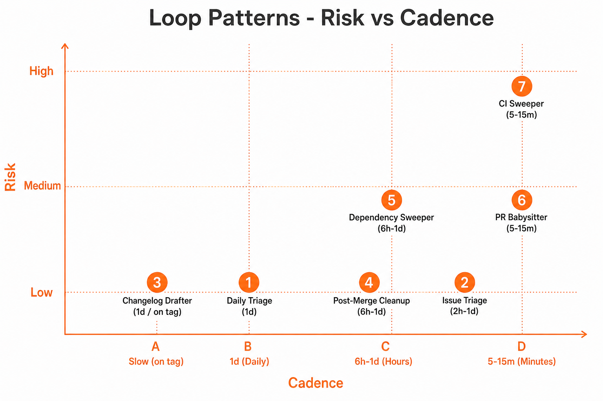
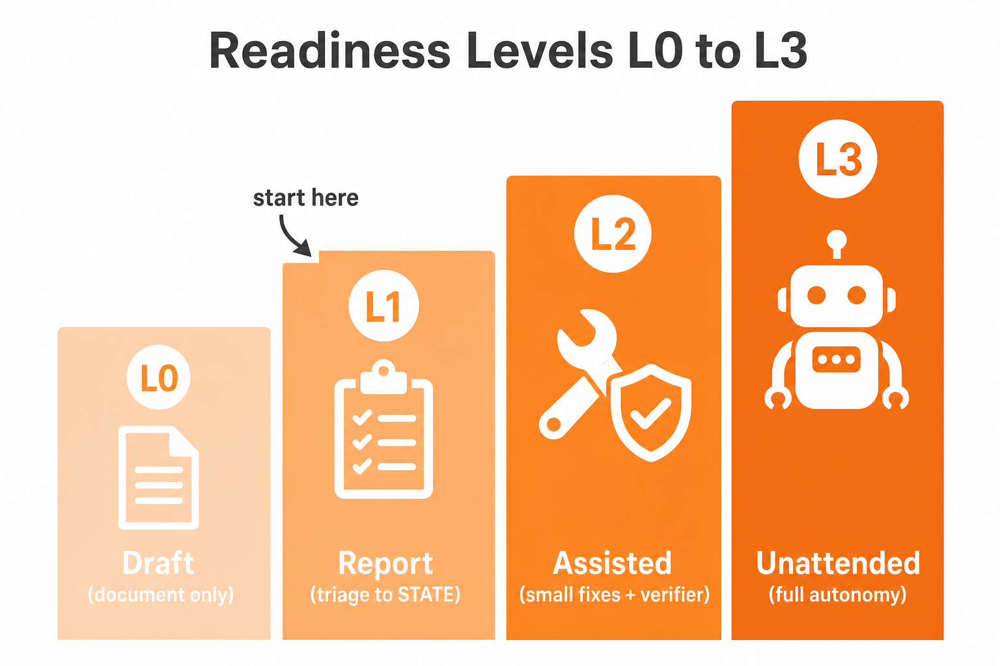

**Loop Engineering series · 5 of 6** · [Previous](/blog/loop-engineering-your-first-loop) · Next: [The Hard Realities](/blog/loop-engineering-hard-realities)

You have a working L1 loop on Souso. Now what else can you build? Seven production patterns cover most real-world needs, from safe morning reports to dangerous CI auto-fix. Each one below includes a **Souso vignette** so the pattern isn't abstract.

Pattern names, cadences, risk levels, and the L0–L3 rollout come from [Cobus Greyling's loop-engineering repo](https://github.com/cobusgreyling/loop-engineering/tree/main/patterns) (MIT). Souso examples are original to this series.

*Haven't run the example yet? [Post 4](/blog/loop-engineering-your-first-loop) has the clone-and-run walkthrough.*



---

# A few terms first

This post assumes you built the **Daily Triage** loop from the previous article (scan once a day, write to `STATE.md`, change nothing). If any of the shorthand below is unfamiliar, read this block once:

| Term | Plain meaning |
|------|----------------|
| **CI** (continuous integration) | Automated checks on every push or PR: tests, lint, typecheck, build. "CI is red" = something failed. |
| **PR** (pull request) | A proposed code change on GitHub waiting for review and merge. |
| **L1** | Report-only. The loop reads the repo and writes findings. No edits. |
| **L2** | Assisted. Small fixes allowed, usually with a verifier or human approval. |
| **L3** | Unattended. The loop may change code and open PRs without you watching. |

Patterns **6** and **7** have informal nicknames you will see in ops chat and in the next post:

- **PR Babysitter**: Checks open PRs every few minutes. Is CI green? Any merge conflicts? Reviews going stale? At L2 it only flags problems; at L3 it may try tiny fixes (lint, typos).
- **CI Sweeper**: Reacts when CI fails. Read the log, attempt a fix, run tests, open or update a PR. High risk because it writes code on its own.

The full **L0–L3** rollout table is at the end of this post.

---

# 1. Daily Triage (Start Here)

**Cadence**: 1 day  
**Risk**: Low  
**Readiness**: L1 (report-only)

Every morning, scan open issues, PRs to `develop`, and CI status. Write structured findings to `STATE.md`. Change nothing.

**Souso example:** The loop we built in the previous post. It surfaces #401 (RangeError), #444 (admin UX), and stale PRs waiting on the `gate` job. ~50k tokens per run.

```bash
/loop 1d "Run loop-triage. Update STATE.md. L1: no code changes."
```

# 2. Issue Triage

**Cadence**: 2h–1d  
**Risk**: Low  
**Readiness**: L1 (propose-only)

Focus on new and unlabeled issues. Suggest labels, flag duplicates, propose assignees. Human approves before any label is applied.

**Souso example:** [#528 Ingredient replacement](https://github.com/RonanCodes/smart-cart/issues/528) arrived unlabeled. Issue Triage proposes `enhancement` + `needs-scope` and flags it **Waiting on Human** until product confirms scope. Souso already uses `ready-for-agent`, `bug`, and other labels. This loop keeps the queue clean.

# 3. Changelog Drafter

**Cadence**: 1d or on tag  
**Risk**: Low  
**Readiness**: L1 (draft)

Scan merged PRs and draft a changelog entry. No code changes; worst case is a messy draft you edit.

**Souso example:** Souso promotes `develop` → `main` for prod deploys. After a promotion PR merges, the loop drafts a changelog from the commit range: new week-menu features, cart pricing fixes, admin updates. Draft goes to a file or GitHub Release draft.

# 4. Post-Merge Cleanup

**Cadence**: 6h–1d (off-peak)  
**Risk**: Low  
**Readiness**: L1 → L2

Remove stale feature flags, delete merged branches, address TODO comments introduced in recent merges.

**Souso example:** After shipping a week-menu feature, a `VITE_SHOW_NEW_WEEK_UI` flag might still be `true` in code. Post-merge cleanup at 22:00 removes it off-peak so it doesn't collide with active `develop` PRs.

# 5. Dependency Sweeper

**Cadence**: 6h–1d  
**Risk**: Medium  
**Readiness**: L2 (patch-only)

Check for outdated or vulnerable dependencies. Patch bumps only; minor/major escalates to human.

**Souso example:** Souso runs on Cloudflare Workers with TanStack Start, Drizzle, and React 19. A patch bump to `wrangler` or `vitest` might be safe; a major React bump is **never** auto-merged. Workers compat and SSR behaviour need human review.

# 6. PR Babysitter (watch open PRs)

**Cadence**: 5–15 min  
**Risk**: Medium  
**Readiness**: L2 (watch) → L3 (fix)

Think of a babysitter for your pull requests: something that keeps an eye on them while you are in meetings. Each run asks: Did CI pass? Is there a merge conflict with `develop`? Has this PR sat idle too long? At L2 it only writes alerts (to `STATE.md` or Slack). At L3 it may push a small fix and re-run CI.

**Souso example:** A PR into `develop` fails the `gate` job (`pnpm quality`). Babysitter investigates: is it a lint error (maybe fixable) or a matcher eval regression (escalate, owned flow)? Early exit if no PRs need attention, under 5k tokens.

**Critical:** Hard-cap at 3 fix attempts. Souso's active `develop` branch can have multiple PRs. A 5-minute cadence with full sub-agent chains burns tokens fast.

# 7. CI Sweeper (fix red CI)

**Cadence**: 5–15 min  
**Risk**: High  
**Readiness**: L3 (cautious)

A sweeper cleans up messes. When CI turns red (a test fails, lint breaks, build errors), this loop investigates the failure, tries a fix, runs the same checks locally, and opens or updates a PR. You are not in the loop unless it escalates. That is why it is L3-only on most teams: one wrong guess can ship a bad patch.

**Souso example:** Matcher eval fails after a pricing change. Sweeper might fix a golden test case. But **#401 RangeError on `/week`** is not a sweeper job: root cause is unknown, reproduce-first is required, and the week generation flow is ownership-sensitive. Sweeper **escalates**, never guesses.

**Mandatory safeguards on Souso:**
- Verifier runs `pnpm quality`, not just unit tests
- Never disable evals to make CI green
- Never auto-edit `src/lib/pricing/*` without human review
- 3 attempts → human

---

# Which Pattern to Run First?



1. **Daily Triage** at L1: run for a week on Souso *(done in post 4)*
2. Add **Issue Triage** or **Changelog Drafter**: cheap, no risk
3. **PR Babysitter** or **Dependency Sweeper** at L2 when L1 is accurate
4. **CI Sweeper** only after robust verification and explicit approval

**Souso rule:** Never L3 on owned AI flows (`src/lib/pricing/*`, week generation, replan internals) without ownership review. The `ship-flow-and-ownership` skill exists for a reason.

# The Phased Rollout

| Level | Description | What's enabled |
|-------|-------------|----------------|
| **L0: Draft** | Documented intent only | `LOOP.md`, no automation |
| **L1: Report** | Triage → state, no auto-action | Daily Triage *(Souso today)* |
| **L2: Assisted** | Small fixes + verifier | PRs for allowlisted paths |
| **L3: Unattended** | Runs without you watching | CI Sweeper, full autonomy |

Never skip L1 on a production repo. One week of report-only tells you more than a month of guessing.

---

**Loop Engineering series · 5 of 6** · [Previous](/blog/loop-engineering-your-first-loop) · Next: [The Hard Realities](/blog/loop-engineering-hard-realities)

*Sources: [Addy Osmani's Loop Engineering](https://addyosmani.com/blog/loop-engineering/). Seven patterns and L1–L3 rollout from [Cobus Greyling's loop-engineering repo](https://github.com/cobusgreyling/loop-engineering) (MIT). [Cobus Greyling's Loop Engineering essay](https://cobusgreyling.substack.com/p/loop-engineering).*
