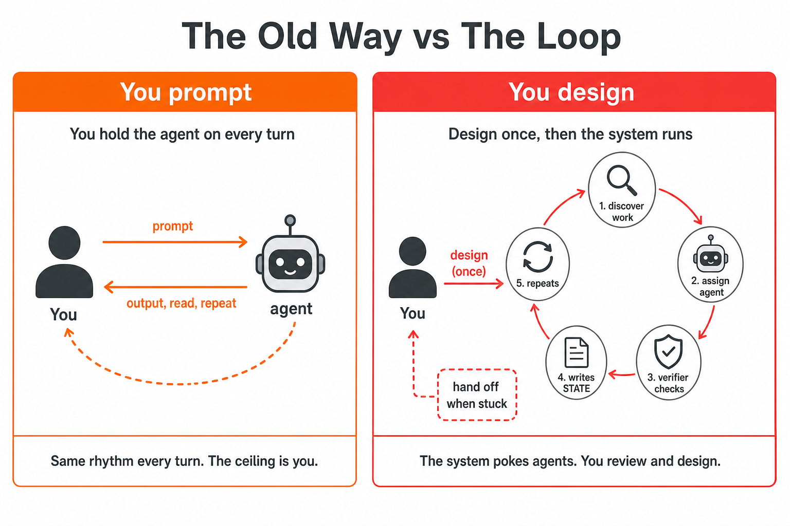

**Loop Engineering series · 1 of 6** · Next: [The Five Building Blocks + Memory](/blog/loop-engineering-the-five-building-blocks)

In June 2026, something shifted in how the people building the most with AI coding agents talk about their work. Peter Steinberger said: *"You shouldn't be prompting coding agents anymore. You should be designing loops that prompt your agents."* Boris Cherny, who leads Claude Code at Anthropic, echoed the same sentiment: *"I don't prompt Claude anymore. I have loops running that prompt Claude and figuring out what to do. My job is to write loops."*

This shift, from *crafting the perfect prompt* to *designing the system that crafts the prompts*, is what's being called **Loop Engineering**.

Over this six-post series, we'll build a real loop on **[Souso](https://github.com/RonanCodes/smart-cart)**, a deployed AI meal planner with 50+ open issues, strict TDD, and a `ready-for-agent` issue queue. Not a toy repo. A team of seven shipped Souso at [Megathon](https://megathon.xyz/) Amsterdam in June 2026; three of us wrote the code, in less than 48 hours, with more than 350 PRs merged. A production app where loops have to respect ownership boundaries and `pnpm quality` gates.

# How to follow along

| Lane | Who it's for | What to do |
|------|----------------|------------|
| **Read only** | You want the ideas first | Stay on this page. Souso is the running example; no repo required yet. |
| **Try it on Souso** | You want hands-on | Jump to [Building Your First Loop on Souso](/blog/loop-engineering-your-first-loop). Clone branch [`feat/loop-engineering-daily-triage`](https://github.com/RonanCodes/smart-cart/tree/feat/loop-engineering-daily-triage) ([PR #529](https://github.com/RonanCodes/smart-cart/pull/529)). L1 Daily Triage is report-only: read GitHub, write `STATE.md`, change no application code. |
| **Use your own repo** | You are porting patterns | Same scaffold (`STATE.md`, skills, schedule). Swap labels, denylist paths, and your CI command instead of `pnpm quality`. |

The hands-on walkthrough is **post 4**. Posts 1–3 are concepts; posts 5–6 assume you have run L1 triage at least once (or read post 4 closely).

---

# The Old Way

For the past two years, working with a coding agent followed a familiar rhythm. You write a prompt, you read what comes back, you write the next prompt. The agent is a tool and you're holding it the entire time, one turn after the other. Your leverage came from your ability to write good prompts and share the right context.

This worked. It still works. But the ceiling on that approach is *you*. Every minute you spend typing the next prompt is a minute you're not designing, reviewing, or thinking about architecture.

# The Loop

A loop is a recursive goal. You define a purpose (*monitor CI for failures* or *triage new issues*) and the AI iterates (often with sub-agents, verification, and external state) until the goal is complete or the loop decides to hand off to you.

Addy Osmani put it succinctly: *"You build a small system that finds the work, hands it out, checks it, writes down what is done and then decides the next thing, and you let that system poke the agents instead of you."*

# Why Now, Not a Year Ago

A year ago, building a loop meant writing and maintaining a pile of bash scripts. It was brittle, custom, and yours alone to maintain. Today, the primitives ship inside the products.

Both Claude Code and OpenAI Codex have landed on the same five building blocks: automations, worktrees, skills, plugins/connectors, and sub-agents. Plus memory/state, the durable spine outside any conversation.

As Addy notes: *"Once you notice the shape is the same you stop arguing about which tool, you just design a loop that still works no matter which one you happen to be sitting in."*

# Loop Engineering vs Harness Engineering

This builds on earlier ideas. **Agent Harness Engineering** (which I'll cover in a future post) is about making the environment one single agent runs inside: the tools, context, permissions, and rules. The harness is the sandbox.

**Loop Engineering** sits one floor above the harness. It's the harness, but it runs on a timer, it spawns little helpers, and it feeds itself.

Cobus Greyling frames it as three conceptual layers (see his [loop-engineering reference repo](https://github.com/cobusgreyling/loop-engineering) and [essay](https://cobusgreyling.substack.com/p/loop-engineering)):

1. **Context Engineering**: getting the right information into the agent's context window
2. **Harness Engineering**: building the environment for a single agent session
3. **Loop Engineering**: orchestrating multiple agent runs over time, with scheduling, state, and verification

# The Leverage Point Has Moved

The most important insight from everyone working on this is that the leverage point has moved. It's no longer about writing better prompts. It's about writing better loops. Not a bigger prompt but a system that discovers, assigns, verifies, persists, and knows when to hand off to you.

Boris Cherny put it starkly: *"A lot of my code these days is written by 'routines'. I'm not doing the prompting. I create the routines that do the prompting."*

# What's Coming Next

This is the first post in a six-part series on Loop Engineering:

1. **The End of Prompting** *(you are here)*: the shift and why it matters
2. **[The Five Building Blocks + Memory](/blog/loop-engineering-the-five-building-blocks)**: the six primitives every loop needs
3. **[Where Work Enters the Loop](/blog/loop-engineering-where-work-enters)**: how GitHub, Slack, Linear, and CI become loop input
4. **[Building Your First Loop on Souso](/blog/loop-engineering-your-first-loop)**: hands-on Daily Triage at L1
5. **[Loop Patterns](/blog/loop-engineering-patterns)**: seven production patterns with Souso examples
6. **[The Hard Realities](/blog/loop-engineering-hard-realities)**: failure modes, token costs, and cognitive surrender

But before we go further, one note from Addy Osmani that's worth sitting with:

> *"Build the loop. But build it like someone who intends to stay the engineer, not just the person who presses go."*

The loop amplifies judgment, both good and bad. Designing well is still on you.

---

**Loop Engineering series · 1 of 6** · Next: [The Five Building Blocks + Memory](/blog/loop-engineering-the-five-building-blocks)

*Sources: [Addy Osmani's Loop Engineering](https://addyosmani.com/blog/loop-engineering/) (June 2026). Conceptual framing and the harness vs loop distinction draw on [Cobus Greyling's loop-engineering repo](https://github.com/cobusgreyling/loop-engineering) (MIT) and his [Loop Engineering essay](https://cobusgreyling.substack.com/p/loop-engineering).*
