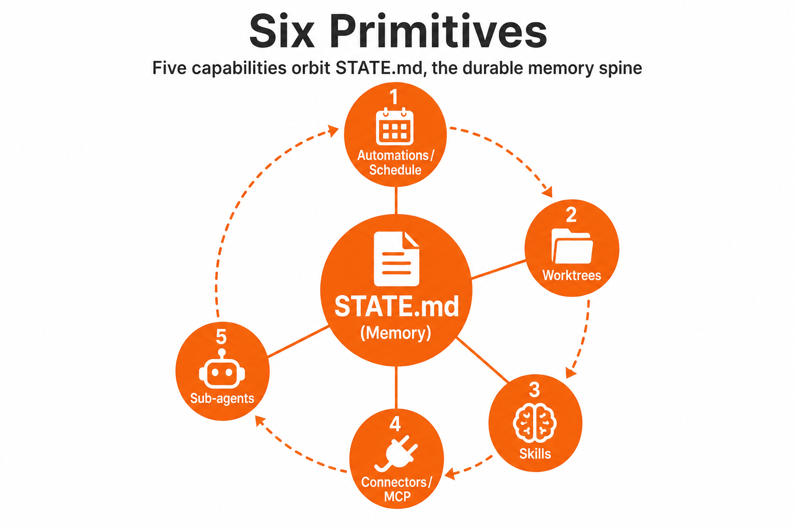

**Loop Engineering series · 2 of 6** · [Previous](/blog/loop-engineering-the-end-of-prompting) · Next: [Where Work Enters the Loop](/blog/loop-engineering-where-work-enters)

A loop that actually runs unattended is not one long prompt. It's a small system with six parts. Five are capabilities. The sixth is the spine that holds state between runs. These are the primitives of Loop Engineering, and both Claude Code and OpenAI Codex now ship all of them.

We'll map each primitive to **Souso** ([smart-cart](https://github.com/RonanCodes/smart-cart)), the case study for this series. A team of seven built it at [Megathon](https://megathon.xyz/) Amsterdam in under 48 hours; three devs committed the code and merged more than 350 PRs, so the abstractions land on something real. Clone the loop example: [`feat/loop-engineering-daily-triage`](https://github.com/RonanCodes/smart-cart/tree/feat/loop-engineering-daily-triage) ([PR #529](https://github.com/RonanCodes/smart-cart/pull/529)).

---

# 1. Automations / Scheduling

Without a schedule, you have a one-off agent session. With one, you have discovery and triage on a cadence.

This is the piece that turns *"I should check CI every morning"* into something that happens whether or not you open a terminal. The heartbeat does not need to be clever, but it needs to be reliable.

**In practice:**
- **Claude Code**: `/loop`, `/schedule`, `/goal`: run until a verifiable condition is met, with a separate model checking "done" so the worker doesn't grade its own homework. Hooks and GitHub Actions carry the same idea into persistence outside the chat.
- **Codex App**: The Automations tab: pick project, prompt, cadence, environment; results land in a Triage inbox. `/goal` for run-until-done.
- **Grok**: `/loop [interval] <prompt>` plus underlying scheduler tools (`scheduler_create`, `scheduler_list`, `scheduler_delete`).

**On Souso:** Daily Triage runs via `/loop 1d` in Claude Code, documented in `LOOP.md`. Souso already has a partial automation: `.github/workflows/claude-review.yml` runs an advisory PR review on every PR to `develop` and `main`. That's a single-step loop, not a full triage loop, but it shows the shape.

**Key properties**: interval, fire-immediately, recurring vs one-shot, durable (survives restarts).

# 2. Worktrees

Two agents editing the same files at the same time is a merge disaster waiting to happen.

Isolated git worktrees give each agent its own working directory while sharing history. Sub-agents can be launched into fresh checkouts so parallel work does not collide.

**In practice:**
- **Claude Code**: `git worktree`, `--worktree`, `isolation: worktree` on sub-agent spawn
- **Codex App**: Built-in worktree per thread
- **Grok**: Pass `isolation: "worktree"` when spawning sub-agents

**On Souso:** Feature branches PR into `develop`, then `develop` promotes to `main` for prod. At L1 (report-only) we don't need worktrees. At L2, each `ready-for-agent` issue gets an isolated worktree off `origin/main`, same discipline as human contributors in `CONTRIBUTING.md`.

Cleanup matters. A loop that leaves orphaned worktrees behind is a loop you will regret.

# 3. Skills

Every session, the agent starts cold. Conventions, build commands, review standards, and the incident that taught you "we do not do it that way": all of it has to be re-derived unless you externalise it.

Skills are how you pay down intent debt.

**On Souso:** Skills already live in `.claude/skills/`: `reproduce-first-tdd`, `ship-flow-and-ownership`, `ai-safe-and-fast`, and others. The loop adds `.claude/skills/loop-triage/SKILL.md`, which encodes how to scan issues, respect the denylist, and write structured `STATE.md` output.

Without skills, every loop run is day one. The agent fills in missing intent with confident guesses, and on Souso, a guess about the AH matcher or week generation is expensive.

# 4. Plugins & Connectors (MCP)

A loop that can only read the filesystem is a loop that can only suggest.

MCP-based connectors let the loop _act_: open PRs, update tickets, post to Slack, query a database. The loop stops being a commentator and starts being an operator.

**On Souso:** GitHub is the issue tracker, not Linear or Jira. At L1, the loop reads issues and PRs via GitHub MCP or `gh` CLI. At L2+, it can comment on issues and open PRs. Slack is optional for escalations.

**Important**: Start with read-only connectors at L1. Expand to write scopes only after trust is earned.

> Connectors are how GitHub Issues become loop input. The next post walks through the full intake pipeline: where bugs and tickets actually come from.

# 5. Sub-agents (Maker/Checker Split)

The agent that wrote the code is a terrible judge of its own work. This is structural, not a model limitation.

One agent explores and implements. A different one (sometimes a stronger model, always with different instructions) verifies against specs, skills, and tests.

**Common splits:**
- Explorer → Implementer → Verifier
- Implementer → Security reviewer
- Implementer → Test writer + runner

**On Souso:** At L2, a bug fix for #401 (RangeError on `/week`) needs implementer + verifier, and the verifier must run `pnpm test`, not just eyeball the diff. Souso's `reproduce-first-tdd` skill means the implementer writes a failing test first; the verifier confirms the test actually failed for the right reason before the fix.

**The rule**: The implementer must never mark its own work as "done."

# + Memory / State

None of the above survives a session boundary on its own. The model forgets everything between runs. The memory has to be on disk, not in the context window.

**On Souso:**
- `STATE.md`: what's high priority, what's ready for an agent, what's waiting on a human
- `loop-run-log.md`: append-only observability
- `loop-budget.md`: token limits and denylist
- `LOOP.md`: human-readable design doc (our addition)

Good state answers three questions:
- What are we working on right now?
- What did we try last time, and what happened?
- What is waiting for a human?

# Souso Primitive Map

| Primitive | Souso implementation |
|-----------|---------------------|
| Scheduling | `/loop 1d` + `LOOP.md` |
| Worktrees | L2+ per issue; `develop`/`main` flow for humans |
| Skills | `.claude/skills/loop-triage/` + existing canon skills |
| Connectors | GitHub MCP / `gh` (read at L1, write at L2+) |
| Sub-agents | L2+ implementer + verifier |
| Memory | `STATE.md`, `loop-run-log.md`, `loop-budget.md` |

# How They Fit Together

A minimal viable loop starts with just three things: scheduling + one skill (triage) + a state file.

You then add:
- Worktree isolation when you start making changes
- Sub-agent verification when the loop is acting autonomously
- Connectors when you want it to drive tickets and PRs instead of just suggesting

Don't run before you can walk. Start at L1 (report only). Graduate to L2 (assisted fixes). Only then consider L3 (unattended).

---

**Loop Engineering series · 2 of 6** · [Previous](/blog/loop-engineering-the-end-of-prompting) · Next: [Where Work Enters the Loop](/blog/loop-engineering-where-work-enters)

*Further reading: [Addy Osmani's Loop Engineering](https://addyosmani.com/blog/loop-engineering/) and [Cobus Greyling's Loop Engineering essay](https://cobusgreyling.substack.com/p/loop-engineering).*
