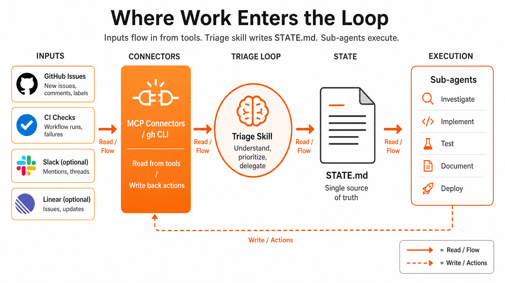

**Loop Engineering series · 3 of 6** · [Previous](/blog/loop-engineering-the-five-building-blocks) · Next: [Building Your First Loop on Souso](/blog/loop-engineering-your-first-loop)

The question I hear most often after explaining loops: *"OK, but where does the context come from? Bugs in Jira, messages in Slack, tickets in Linear. How does the loop know any of that exists?"*

Short answer: **nothing arrives by magic.** Something fetches it on every run. Usually a triage skill plus connectors (MCP) or CLI tools. The loop normalizes what it finds into `STATE.md`, and everything downstream reads from there.



---

# The Misconception

A loop is not a bigger prompt with institutional memory. It is a scheduled job that:

1. **Discovers** work from external systems
2. **Normalizes** findings into structured state
3. **Decides** what to act on (or escalate to you)

If step 1 is missing, you have a cron job that re-reads the same `README.md` every morning. Useful for lint, useless for triage.

# Three Layers of Intake

## Layer 1: Filesystem (L1 default, no MCP required)

The agent can already see a lot without connectors:

- `git log --oneline -20` for recent commits
- `gh pr list --base develop` for open PRs
- `gh issue list --label bug` for labeled bugs
- Local test output if you run checks in the skill

This is enough for week one. Souso's Daily Triage at L1 uses `gh` against [github.com/RonanCodes/smart-cart/issues](https://github.com/RonanCodes/smart-cart/issues).

## Layer 2: Connectors / MCP (L1+ recommended)

MCP (Model Context Protocol) servers expose tools the agent calls during a run:

| Source | MCP tool examples | What the loop learns |
|--------|-------------------|----------------------|
| **GitHub** | `list_issues`, `get_pull_request`, `get_check_runs` | Open bugs, PR status, CI red/green |
| **Linear** | `list_issues`, `get_issue` | Sprint backlog, blocked tickets |
| **Jira** | `search_issues` (JQL) | Bugs by priority, sprint scope |
| **Slack** | `read_channel`, `search_messages` | User-reported bugs, on-call threads |

The triage **skill** tells the agent *which* tools to call and *how* to format the output. The connector is the pipe; the skill is the brain.

## Layer 3: Webhooks (advanced, optional)

Slack, Jira, and GitHub can push events to a queue when something changes. That's real-time intake: powerful, but more infrastructure than you need for week one. Start with pull-based discovery on a schedule.

---

# Worked Example: Souso Daily Triage Run

**Souso** is the AI meal planner we shipped at [Megathon](https://megathon.xyz/) Amsterdam: a team of seven, three devs committing code, less than 48 hours, more than 350 PRs merged. The L1 scaffold lives on [`feat/loop-engineering-daily-triage`](https://github.com/RonanCodes/smart-cart/tree/feat/loop-engineering-daily-triage) ([PR #529](https://github.com/RonanCodes/smart-cart/pull/529)). It uses **GitHub Issues**, not Linear or Jira. Here's what one run looks like.

## 1. The heartbeat fires

```bash
/loop 1d "Run loop-triage skill. Read STATE.md and loop-budget.md. Scan GitHub issues and develop PRs. Update STATE.md. Append to loop-run-log.md. L1: no code changes."
```

## 2. The skill instructs discovery

The `loop-triage` skill (in `.claude/skills/loop-triage/SKILL.md`) says:

- Read prior `STATE.md` and prune closed/merged items
- Fetch open issues with `ready-for-agent` and `bug` labels
- Fetch open PRs to `develop`; check `gate` CI status
- Flag stale issues (7+ days no activity)

The agent calls GitHub MCP or `gh`:

```bash
gh issue list --label ready-for-agent --state open
gh issue list --label bug --state open
gh pr list --base develop --json number,title,statusCheckRollup
```

## 3. Findings normalize into STATE.md

Raw API dumps are useless. The skill requires structured one-liners:

```markdown
## High Priority
- #401: RangeError on /week, bug label, reproduce-first required
- CI: PR #512 gate failing on matcher eval

## Ready for Agent
- #444: Admin UX overhaul (design system)
- #428: Basket price comparison across supermarkets

## Waiting on Human
- #408: Beta-tester flow, proposal not confirmed
- #528: Ingredient replacement, needs scope before agent picks up
```

## 4. Next run picks up where this one stopped

Tomorrow's run reads `STATE.md` first. Closed issues get pruned. New #529 appears in **Needs Triage**. The loop compounds because state lives on disk, not in a forgotten chat session.

---

# The Action Phase (L2+)

At L1, the loop stops at `STATE.md`. You read it over coffee.

At L2+, connectors **write back**:

| Action | Tool | Example on Souso |
|--------|------|------------------|
| Comment on issue | GitHub MCP | "Loop: opened PR #515 for #401" |
| Open PR | GitHub MCP | Branch from worktree, link issue |
| Update ticket status | Linear/Jira MCP | Move to "In Review" |
| Escalate | Slack MCP | Post to `#loop-escalations` |

Write scopes come *after* a week of accurate L1 reports. Least privilege always.

---

# If You Use Linear Instead of GitHub

Same pattern, different MCP server:

1. Schedule fires triage skill
2. Skill calls `linear.listIssues({ filter: { labels: ["ready-for-agent"] } })`
3. Skill writes normalized findings to `STATE.md`
4. L2: `linear.updateIssue` to comment or change status

The loop shape is identical. Only the connector changes.

# If You Use Jira

1. Skill runs JQL: `project = SOUSO AND labels = ready-for-agent AND status != Done`
2. Normalize to `STATE.md`
3. L2: `jira.addComment` on escalation

# If You Use Slack for Bug Reports

Slack is usually a **supplement**, not the primary queue:

1. Skill reads `#bugs` channel for messages in the last 24h
2. Cross-reference with GitHub: if no issue exists, add to **Waiting on Human**: "Slack: user reported cart crash, no GitHub issue yet"
3. L1 never auto-creates issues; a human decides whether to file one

---

# Why STATE.md Is the Hub

External tools are messy. Different APIs, different field names, different labels. `STATE.md` is your **canonical intake format**, the lingua franca every loop run and every sub-agent understands.

```
GitHub ──┐
Linear ──┼──> Triage Skill ──> STATE.md ──> Sub-agents ──> PR / comment / escalate
Slack  ──┘
CI     ──┘
```

The connectors answer "where does work come from?" `STATE.md` answers "what should we do about it?"

---

**Loop Engineering series · 3 of 6** · [Previous](/blog/loop-engineering-the-five-building-blocks) · Next: [Building Your First Loop on Souso](/blog/loop-engineering-your-first-loop)

*Sources: [Addy Osmani's Loop Engineering](https://addyosmani.com/blog/loop-engineering/). The `STATE.md` intake hub pattern from [Cobus Greyling's loop-engineering repo](https://github.com/cobusgreyling/loop-engineering) (MIT). [Cobus Greyling's Loop Engineering essay](https://cobusgreyling.substack.com/p/loop-engineering).*
