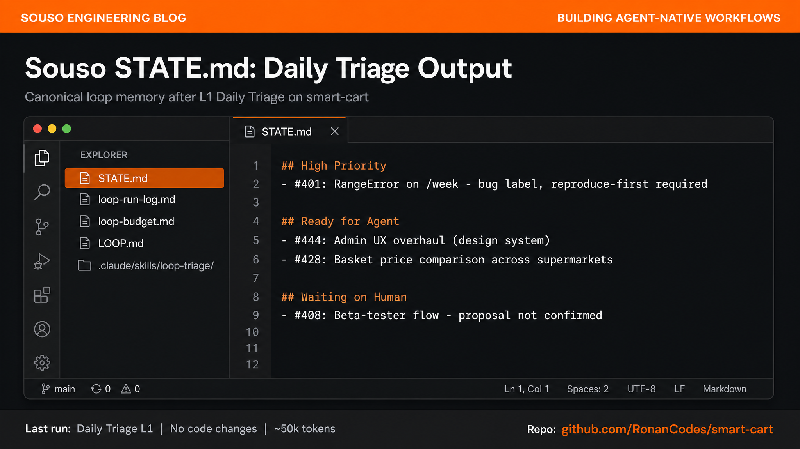

**Loop Engineering series · 4 of 6** · [Previous](/blog/loop-engineering-where-work-enters) · Next: [Loop Patterns](/blog/loop-engineering-patterns)

You know the primitives. You know where work enters the loop. Now we build one on a real repo.

**[Souso](https://github.com/RonanCodes/smart-cart)** (smart-cart) is an AI meal planner deployed at [souso.app](https://souso.app). A team of seven built it at [Megathon](https://megathon.xyz/) Amsterdam in less than 48 hours; three of us committed the code and merged more than 350 PRs over that weekend. It now has 50+ open GitHub issues, a `ready-for-agent` label queue, strict reproduce-first TDD, and a `pnpm quality` CI gate. We'll add a **Daily Triage loop at L1** (report-only, no code changes, no risk).

By the end you'll have files in the repo and a schedule that surfaces bugs like [#401](https://github.com/RonanCodes/smart-cart/issues/401) before you open GitHub.

---

# Clone the Example

All loop files from this post are on branch [`feat/loop-engineering-daily-triage`](https://github.com/RonanCodes/smart-cart/tree/feat/loop-engineering-daily-triage) ([PR #529](https://github.com/RonanCodes/smart-cart/pull/529)):

```bash
git clone -b feat/loop-engineering-daily-triage https://github.com/RonanCodes/smart-cart.git
cd smart-cart
pnpm install
```

You do not need to merge the PR to follow along. The branch has the scaffold pre-seeded; run the steps below from that checkout.

Alternatively, scaffold any repo with Cobus Greyling's upstream tooling: `npx @cobusgreyling/loop-init . --pattern daily-triage` ([loop-engineering repo](https://github.com/cobusgreyling/loop-engineering)). This walkthrough adapts that layout for Souso.

# Prerequisites

**You need:**

- **Claude Code**, **Codex App**, or **Grok** with scheduling (`/loop` or an equivalent automation)
- **`gh` CLI** logged in with read access to public issues and PRs (enough for L1)
- The checkout above (`pnpm install` pulls deps for skills and scripts; you do not need to run the app)

**You do not need:**

- Merge rights on Souso, a running dev server, or Cloudflare credentials
- To merge [PR #529](https://github.com/RonanCodes/smart-cart/pull/529) (the branch is pre-seeded)

L1 triage only reads GitHub and edits loop files in the repo (`STATE.md`, `loop-run-log.md`). It never touches application source.

---

# What We're Building

| Property | Value |
|----------|-------|
| Pattern | Daily Triage |
| Level | L1 (report-only) |
| Cadence | Once per day |
| Intake | GitHub Issues + PRs to `develop` |
| Output | `STATE.md` + `loop-run-log.md` |
| Code changes | None |

---

# Step 1: Scaffold the Loop Files

The file layout follows [Cobus Greyling's loop-engineering starters](https://github.com/cobusgreyling/loop-engineering/tree/main/starters) (MIT). We adapted denylist paths and Souso-specific rules below.

These files now live in the smart-cart repo root:

```
STATE.md              # Canonical loop memory
loop-run-log.md       # Append-only run history
loop-budget.md        # Token limits + denylist
LOOP.md               # Human-readable design doc
.claude/skills/loop-triage/SKILL.md
```

**STATE.md** answers three questions every run:

- What needs attention today? → **High Priority**
- What's scoped for an agent? → **Ready for Agent**
- What needs a human decision? → **Waiting on Human**

Starter content (already seeded with real Souso issues):

```markdown
## High Priority
- #401: RangeError on /week, bug label, reproduce-first required

## Ready for Agent
- #444: Admin UX overhaul (design system)
- #428: Basket price comparison across supermarkets

## Waiting on Human
- #408: Beta-tester flow, proposal not confirmed
```

**loop-budget.md** encodes Souso-specific guardrails:

- Denylist: `src/lib/pricing/*`, week generation internals, migrations, auth
- Max 500k tokens/day
- L1 only, no sub-agents yet

**LOOP.md** documents the design so any teammate (or agent) can understand the loop without reading this blog post.

---

# Step 2: Write the Triage Skill

The skill at `.claude/skills/loop-triage/SKILL.md` is the most important file. It tells the agent *what* to fetch and *how* to report.

Souso-specific rules baked in:

1. **`ready-for-agent`** label = agent queue
2. **`bug`** label = always flag "reproduce-first required"
3. **Ownership**: issues touching `src/lib/pricing/*` get "ownership review required"
4. **Structured output only**: one-liners, no prose (so L2 can parse `STATE.md`)
5. **L1 constraints**: edit only `STATE.md` and `loop-run-log.md`

---

# Step 3: Wire the Schedule

In Claude Code, from the smart-cart checkout:

```bash
/loop 1d "Run loop-triage skill. Read STATE.md and loop-budget.md. Scan GitHub issues and develop PRs. Update STATE.md with findings. Append one row to loop-run-log.md. L1: no code changes."
```

**Codex App alternative:**
- Automations tab → new automation "Souso Daily Triage"
- Cadence: 1 day
- Prompt: same as above
- Results: Triage Inbox

**Grok alternative:**

```bash
/loop 1d Run loop-triage. Update STATE.md. No auto-fix.
```

---

# Step 4: Run Manually First

Before the schedule takes over:

```bash
/loop 0 "Run loop-triage once. Update STATE.md. Report findings."
```

Read the output. Open `STATE.md`. Ask:

- Did it find #401 under **High Priority**?
- Did it list #444 and #428 under **Ready for Agent**?
- Did it flag #408 as **Waiting on Human**?
- Did it miss anything you'd expect?



**Week-one success criterion:** Did the loop surface #401 before you opened GitHub? If yes, L1 is working.

---

# Step 5: Review After One Week

| Question | What good looks like on Souso |
|----------|-------------------------------|
| **Accuracy** | Caught new bugs, didn't hallucinate closed issues |
| **Value** | You start the day reading `STATE.md`, not scrolling 50 issues |
| **Format** | Team can scan sections in under 60 seconds |
| **Cost** | ~50k tokens/day, worth it for the signal |

If accuracy is good, consider adding **Issue Triage** (L1) for unlabeled issues like #528. Do **not** jump to L2 until triage is trustworthy.

---

# What L2 Looks Like (Not Yet)

When you're ready, after one week of accurate L1:

1. **Worktree isolation**: one worktree per `ready-for-agent` issue
2. **Implementer + verifier**: verifier runs `pnpm test`, not vibes
3. **Reproduce-first**: bug fixes start with a failing test per `reproduce-first-tdd` skill
4. **GitHub MCP write**: open PRs, comment on issues; never merge
5. **Max 3 attempts**: then escalate to human

Example L2 scope: typo in a comment, missing import in a test file. **Not** #401 RangeError on first attempt; that needs human triage to confirm root cause.

---

# Quick Reference

```bash
# Manual run
/loop 0 "Run loop-triage once, update STATE.md"

# Daily schedule
/loop 1d "Run loop-triage skill. L1: no code changes."

# Files to check
cat STATE.md
tail loop-run-log.md
```

---

# The Most Important Thing

> *"Build the loop. But build it like someone who intends to stay the engineer, not just the person who presses go."*
>
> Addy Osmani

Souso has eval gates, ownership boundaries, and a promotion flow (`develop` → `main`). A loop that ignores those isn't leverage; it's liability. Start at L1. Read the output. Build trust. Then expand.

---

**Loop Engineering series · 4 of 6** · [Previous](/blog/loop-engineering-where-work-enters) · Next: [Loop Patterns](/blog/loop-engineering-patterns)

*Sources: [Addy Osmani's Loop Engineering](https://addyosmani.com/blog/loop-engineering/). Loop scaffold from [Cobus Greyling's loop-engineering starters](https://github.com/cobusgreyling/loop-engineering/tree/main/starters) (MIT). [Cobus Greyling's Loop Engineering essay](https://cobusgreyling.substack.com/p/loop-engineering). Souso loop example: [PR #529](https://github.com/RonanCodes/smart-cart/pull/529) · [`feat/loop-engineering-daily-triage`](https://github.com/RonanCodes/smart-cart/tree/feat/loop-engineering-daily-triage).*
