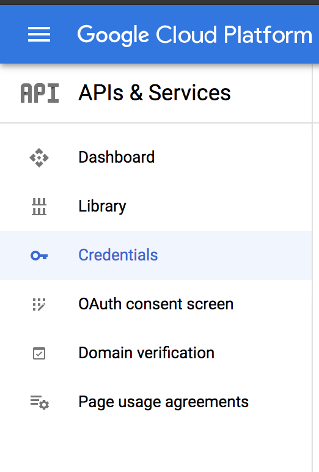
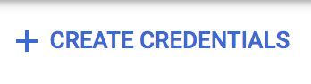
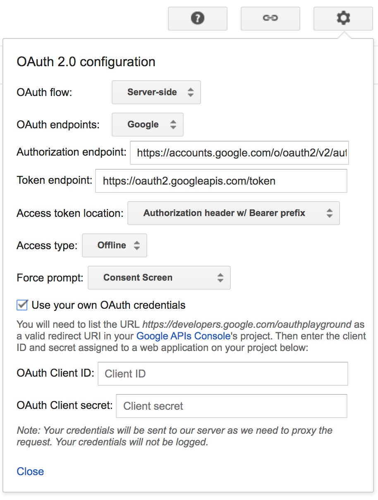
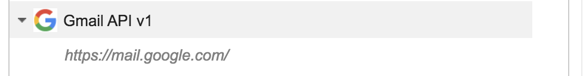

Through this post you'll create a simple serverless function, setup Nodemailer to work with Gmail + Oauth2, and deploy that function to Vercel.

---

# Gmail + Oauth2 authentication

You'll be granting you app permissions to send emails in your name.

## Cloud Platform Setup

If you haven't signed up yet, go to https://console.cloud.google.com/ and create an account.

1. Create a new project
2. Go to credentials
   

3. Click *Create new credential*s and **select OAuth client ID**
   
4. If this is your first ID you need to configure your consent screen. Click _Configure consent screen_ , select _external_ and press _Create_
   1. In this step you need to setup your app name
   2. Press _Save_
   3. Go back to Credentials, click *Create new credential*s , and **select OAuth client ID**
5. In **Application type**, select "Web Application"
6. Complete the name and in **Authorized redirect URIs** add `https://developers.google.com/oauthplayground`
7. Press **Create**
8. Copy and save your Client ID and Client Secret as you'll need it for the following steps. If you missed it, don't worry, you can go back to the **Credentials** menu and see your IDs.

## Oauth Playground

In this step you'll grant your app permissions to use your accounts Gmail.

1. Go to https://developers.google.com/oauthplayground/
2. Click on the settings icon, mark **Use your own OAuth 2.0 credentials**, and fill in with your credentials from the previous step.
   
3. Close
4. You need to select the APIs you want to access. Look for the following and select `https://mail.google.com/`
   
5. Click on **Authorize APIs**
6. At this step, you'll need to select the account that you will use to send the emails.

   > You might get an alert saying _This app isn't verified_, press Advanced and continue.

7. Allow everything
8. Back in the OAuth Playground, press **Exchange authorization code for tokens**, and copy the _refresh_token_ in the response. You'll need this for the following step.

# The serverless function

The boring setup is over. Let's create the serverless function.

# Deploying to Vercel
